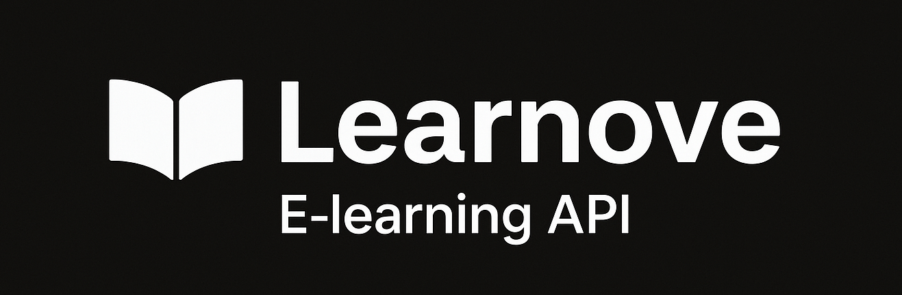
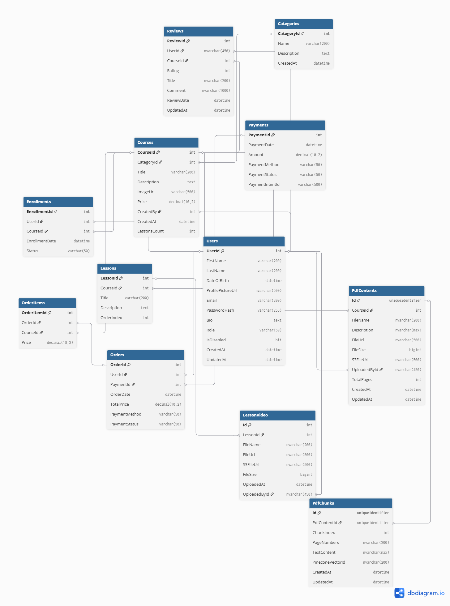

## Table of Contents

- [Features](#features)
- [Architecture](#architecture)
- [Tech Stack](#tech-stack)
- [AI-Powered PDF Processing & Semantic Search](#ai-powered-pdf-processing--semantic-search)
- [Installation](#installation)
- [Contributing](#contributing)
- [License](#license)

---




## Features

### Course Management
- Create, read, update, and delete courses  
- Organize courses by categories and subcategories  
- Upload course materials (videos, PDFs)  
- Support for multiple modules and lessons per course  
- AI-powered course summarization for quick overviews  

### User Management
- User registration and authentication with JWT tokens  
- Role-based access control (student, instructor, admin)  
- Profile management with enrolled courses and progress tracking  
- Password reset functionality  

### Instructor Tools
- Create and manage courses with lessons  
- View feedback and reviews  

### Learning Features
- **AI-Powered Q&A** – Ask questions about specific course content and receive AI-generated answers  
- **Intelligent Content Search** – Semantic search course contents  
- **Smart Content Summarization** –  summaries course contents  

### Enrollment & Progress Tracking
- Enroll students into free or paid courses  

### Payment Integration
- Support for Stripe/PayPal for paid courses  
- Secure checkout sessions and refunds  

### Reviews & Ratings
- Students can review and rate courses  
- Average ratings displayed on course details  

---

## Architecture

Learnova follows a clean architecture pattern with clear separation of concerns.

### Presentation Layer (Learnova.API)
- ASP.NET Core Web API for handling HTTP requests and responses  
- **Controllers** – Handle requests, validate input, interact with services  
- **Filters** – Manage exceptions, validation, and authorization  
- **HealthChecks** – Monitor application health and dependencies  
- **Templates** – Email and notification templates  

### Business Layer (Learnova.Business)
- Core business logic and services  
- Implements business rules for courses, users, enrollment, and AI features  
- Manages data transformation and validation  

### Data Layer (Learnova.Data)
- Entity Framework Core for data access  
- Repository patterns for persistence  
- Database context and entity configurations  

### Infrastructure Layer (Learnova.Infrastructure)
- Integrations with external services (AI, payments, storage)  
- Email services and notifications  
- File storage utilities  

### Common Layer (Learnova.Common)
- Shared utilities, constants, and helpers  
- Cross-cutting concerns such as logging and validation  

### Authorization Layer
- Permission-based authorization system  
- Role management and access control  

---

## Tech Stack

- **Framework** – .NET 9, ASP.NET Core Web API  
- **Database** – MySQL Server, Entity Framework Core  
- **Authentication** – JWT tokens  
- **AI Features** –  
  - Cohere embeddings (`embed-english-v3.0`)  
  - Gemini API for content generation  
- **Vector Database** – Pinecone  
- **Payments** – Stripe integration  
- **Cloud Storage** – AWS S3  
- **Containerization** – Docker support for deployment  
- **Documentation** – OpenAPI/Swagger  

---

## AI-Powered PDF Processing & Semantic Search

This feature enables intelligent content retrieval and Q&A based on uploaded PDF course materials.

### Workflow

1. **Fetch PDF from AWS S3**  
   Connect to an AWS S3 bucket and download the target PDF file.  

2. **Extract PDF Content**  
   Parse and normalize the PDF (text, metadata, optionally images).  
   Clean the extracted text for consistent processing.  

3. **Chunking & Storage**  
   Split the text into manageable chunks (e.g., 500–1000 tokens with overlap).  
   Store chunk metadata and raw text in a MySQL database.  

4. **Embedding Generation**  
   Use the `embed-english-v3.0` model from **Cohere** to generate dense embeddings.  

5. **Vector Store Integration**  
   Add chunks and embeddings to **Pinecone** for semantic search.  

6. **Query Handling**  
   When a user asks a question:  
   - Build a prompt combining the user query with the most relevant context  
   - Retrieve context via semantic search in Pinecone (Top-K similarity)  
   - Send the constructed prompt to the AI model for answer generation


---

# Learnova API – Authentication & Authorization

## Authentication

- **POST** `/api/auth/login` – Authenticate user and return JWT token  
- **POST** `/api/auth/refresh` – Refresh JWT token using refresh token  
- **POST** `/api/auth/revoke-refresh-token` – Revoke refresh token  
- **POST** `/api/auth/register` – Register a new user  
- **POST** `/api/auth/confirm-email` – Confirm email address  
- **POST** `/api/auth/resend-confirmation-email` – Resend confirmation email  

---

## User Profile (Current User)

- **GET** `/me` – Get current user profile information  
- **PUT** `/me/info` – Update user profile details  
- **PUT** `/me/change-password` – Change user password  

---

## User Management

### Users (Admin Only)
- **GET** `/api/users` – Get paginated list of all users  
- **GET** `/api/users/{id}` – Get specific user details  
- **POST** `/api/users` – Create a new user  
- **PUT** `/api/users/{id}` – Update user by ID  
- **PUT** `/api/users/{id}/toggle-status` – Toggle user status (active/inactive)  
- **PUT** `/api/users/{id}/unlock` – Unlock user account  

### Roles (Admin Only)
- **GET** `/api/roles` – Get all roles  
- **GET** `/api/roles/{id}` – Get specific role by ID  
- **POST** `/api/roles` – Create a new role  
- **PUT** `/api/roles/{id}` – Update role by ID  
- **PUT** `/api/roles/{id}/toggle-status` – Toggle role status  
- **GET** `/api/roles/permissions` – Get all available permissions  

---

## Course Management

### Categories
- **GET** `/api/categories` – Get all categories with pagination  
- **GET** `/api/categories/{id}` – Get category by ID  
- **POST** `/api/categories` – Create category *(Admin only)*  
- **PUT** `/api/categories/{id}` – Update category *(Admin only)*  
- **DELETE** `/api/categories/{id}` – Delete category *(Admin only)*  

### Courses
- **GET** `/api/courses` – Get all courses with pagination  
- **GET** `/api/courses/{id}` – Get course by ID  
- **POST** `/api/courses` – Create course *(Admin only)*  
- **PUT** `/api/courses/{id}` – Update course *(Admin only)*  
- **DELETE** `/api/courses/{id}` – Delete course *(Admin only)*  
- **GET** `/api/courses/{id}/members` – Get course members *(Admin/Instructor only)*  
- **POST** `/api/courses/{id}/members` – Add member to course *(Admin/Instructor only)*  

---

## Content Management

### Content Upload
- **POST** `/api/content/courses/{courseId}/upload-pdf` – Upload PDF for a course  
- **POST** `/api/content/lessons/{lessonId}/upload-video` – Upload video for a lesson *(Admin/Instructor only)*  

---

## Reviews & Feedback

### Reviews
- **GET** `/api/reviews` – Get all reviews (Admin only, paginated)  
- **GET** `/api/reviews/{reviewId}` – Get review by ID  
- **POST** `/api/reviews` – Create review *(Authenticated users)*  
- **PUT** `/api/reviews/{reviewId}` – Update review *(Authenticated users)*  

---

## Payment & Commerce

### Payments
- **POST** `/api/payments/create-payment-intent` – Create payment intent  
- **POST** `/api/payments/webhook` – Handle Stripe webhooks *(Public endpoint)*  

---

## Health & Monitoring

### Health Checks
- **GET** `/health` – Full system health check  
- **GET** `/health/live` – Liveness probe  
- **GET** `/health/ready` – Readiness probe (DB connectivity)  
- **GET** `/health/database` – Database health (MySQL)  
- **GET** `/health/ai` – AI services health check  
- **GET** `/health/text-processing` – Text processing health check  
- **GET** `/health/pinecone` – Pinecone vector DB health check  
- **GET** `/health/cohere` – Cohere embedding API health check  
- **GET** `/health/gemini` – Google Gemini AI API health check  

---

## Authorization Notes

- **Public endpoints:** Authentication, health checks, payment webhooks  
- **Authenticated users:** Profile management, content viewing, reviews  
- **Admin only:** User management, categories, courses, system administration  
- **Admin/Instructor:** Course management, content upload, course members  

---

## Installation

### Prerequisites
- .NET 9 SDK  
- MySQL Server  
- Docker (optional)  

### Local Development Setup

1. **Clone the repository**
   ```bash
   git clone <repository-url>
   cd Learnova.API


2. **Restore NuGet packages**
   ```bash
   dotnet restore
   ```

3. **Configure database connection**
   Update the connection string in `appsettings.Development.json`

4. **Run database migrations**
   ```bash
   dotnet ef database update
   ```

5. **Run the application**
   ```bash
   dotnet run --project Learnova.API
   ```
## Contributing

Contributions are welcome! We appreciate your interest in improving Learnova.

### How to Contribute

1. **Fork the repository**
   ```bash
   git clone https://github.com/EslamEed01/learnova-api.git
   ```

2. **Create a new branch for your feature or bug fix**
   ```bash
   git checkout -b feature/your-feature-name
   # or
   git checkout -b bugfix/issue-description
   ```

3. **Make your changes and commit them**
   ```bash
   git add .
   git commit -m "Add: your feature description"
   # or
   git commit -m "Fix: bug description"
   ```

4. **Push to your fork and submit a pull request**
   ```bash
   git push origin feature/your-feature-name
   ```


## License

This project is licensed under the **MIT License**.

**Made with ❤️ by Eslam Eed**

For questions, support, or feature requests, please open an issue on GitHub or contact the maintainers.
